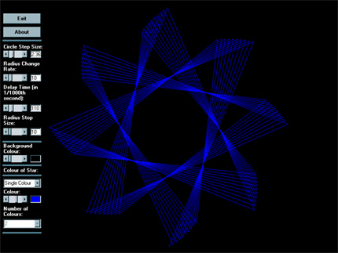

<div align="center">

## Animation of STAR


</div>

### Description

Draws an animated STAR. Give it any shape, size, colour & background-colour and make the star twinkle. JUST GIVE IT A SHOT & SEE IT FOR URSELF.
 
### More Info
 


<span>             |<span>
---                |---
**Submitted On**   |2003-01-03 18:37:56
**By**             |[Adnan Zaman](https://github.com/Planet-Source-Code/PSCIndex/blob/master/ByAuthor/adnan-zaman.md)
**Level**          |Intermediate
**User Rating**    |4.3 (13 globes from 3 users)
**Compatibility**  |VB 5\.0, VB 6\.0
**Category**       |[Graphics](https://github.com/Planet-Source-Code/PSCIndex/blob/master/ByCategory/graphics__1-46.md)
**World**          |[Visual Basic](https://github.com/Planet-Source-Code/PSCIndex/blob/master/ByWorld/visual-basic.md)
**Archive File**   |[The\_SuperN152320132003\.zip](https://github.com/Planet-Source-Code/adnan-zaman-animation-of-star__1-42141/archive/master.zip)

### API Declarations

```
Public Declare Sub Sleep Lib "kernel32" Alias "Sleep" (ByVal dwMilliseconds As Long)
```


